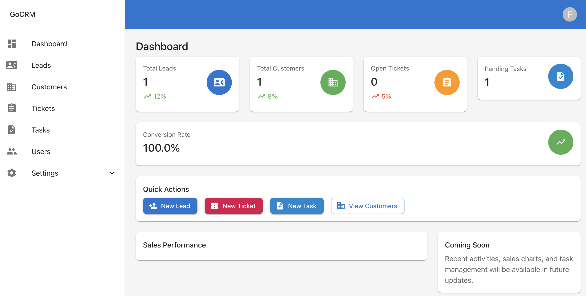
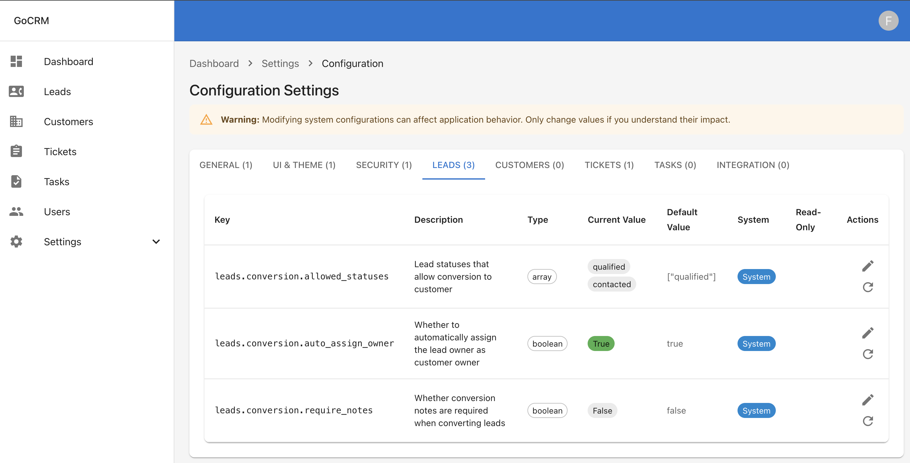

# GopherCRM

A comprehensive Customer Relationship Management (CRM) system built with Go (backend) and React TypeScript (frontend).

## Features

- 🔐 **Authentication**: JWT tokens and API Keys with role-based access control
- 👥 **Lead Management**: Lead tracking with conversion to customers
- 🏢 **Customer Management**: Complete customer lifecycle management
- 🎫 **Ticket System**: Support ticket management with assignments
- ✅ **Task Management**: Task tracking and assignment
- ⚙️ **Configuration Management**: System-wide settings with admin interface
- 🎨 **Modern UI**: React TypeScript frontend with Material-UI
- 📊 **Dashboard**: Analytics and activity overview
- 👤 **Role-Based Access**: Admin, Sales, Support, and Customer roles
- 🔌 **RESTful API**: Clean architecture with comprehensive endpoints



## Tech Stack

### Backend
- **Go 1.23+** - Main backend language
- **Gin** - HTTP web framework
- **GORM** - ORM for database operations
- **MySQL 8.0+** - Primary database
- **JWT** - Authentication tokens
- **Logrus** - Structured logging

### Frontend
- **React 18** - UI framework
- **TypeScript** - Type safety
- **Material-UI (MUI)** - Component library
- **React Router** - Client-side routing
- **TanStack Query** - Data fetching and caching
- **Vite** - Build tool and dev server

## Prerequisites

### Backend
- Go 1.23 or higher
- MySQL 8.0 or higher
- Make (optional, for using Makefile commands)

### Frontend
- Node.js 18+ and npm/yarn
- Modern web browser

## Setup Instructions

### 1. Clone the Repository
```bash
git clone https://github.com/florinel-chis/gophercrm.git
cd gophercrm
```

### 2. Backend Setup

#### Create the Database
```bash
# Using Make (recommended)
make create-db

# Or manually with MySQL
mysql -u root < scripts/create_database.sql
```

#### Configure Environment
```bash
# Create environment file
cp .env.example .env

# Edit .env file with your database credentials
# Default configuration should work for local development
```

#### Install Go Dependencies
```bash
go mod download
```

#### Run Backend Server
```bash
# Using Make (recommended)
make run

# Or directly with Go
go run cmd/main.go
```

The backend server will start on `http://localhost:8080`

### 3. Frontend Setup

#### Navigate to Frontend Directory
```bash
cd gocrm-ui
```

#### Install Dependencies
```bash
# Using npm
npm install

# Or using yarn
yarn install
```

#### Start Development Server
```bash
# Using npm
npm run dev

# Or using yarn
yarn dev
```

The frontend will start on `http://localhost:5173`

## Usage

### Default Access
1. **Open your browser** to `http://localhost:5173`
2. **Register a new account** or use existing credentials
3. **Login** with your credentials

### Admin Features
Admin users have access to additional features:
- User management
- System configuration
- All data access across the system

### Configuration Management

GopherCRM includes a powerful configuration management system that allows administrators to customize system behavior through a web interface.



#### Accessing Configuration Settings
1. Login as an admin user
2. Navigate to **Settings > Configuration**
3. Browse settings by category tabs:
   - **General**: Company information and basic settings
   - **UI & Theme**: User interface customization
   - **Security**: Security-related settings
   - **Leads**: Lead management behavior
   - **Customers**: Customer management settings
   - **Tickets**: Support ticket configuration
   - **Tasks**: Task management settings
   - **Integration**: Third-party integrations

#### Configuration Features
- **Type-Safe Editing**: Different input types based on configuration type (boolean, string, array, etc.)
- **Validation**: Built-in validation for configuration values
- **System Protection**: System configurations are protected from deletion
- **Read-Only Settings**: Some critical settings are read-only
- **Default Values**: Easy reset to default values
- **Real-Time Updates**: Changes take effect immediately

#### Lead Conversion Settings
The configuration system includes specific settings for lead conversion:
- `leads.conversion.allowed_statuses`: Which lead statuses allow conversion to customer
- `leads.conversion.require_notes`: Whether notes are required during conversion
- `leads.conversion.auto_assign_owner`: Auto-assign lead owner as customer owner

## Development

### Backend Development

#### Building
```bash
make build
```

#### Running Tests
```bash
# Run all tests
make test

# Run specific tests
go test -run TestName ./path/to/package

# Run integration tests
go test ./tests
```

#### Database Operations
```bash
# Create database
make create-db

# Reset database (drops and recreates)
make reset-db
```

### Frontend Development

#### Available Scripts
```bash
# Start development server
npm run dev

# Build for production
npm run build

# Preview production build
npm run preview

# Run tests
npm run test

# Run linting
npm run lint

# Type checking
npm run type-check
```

#### Development Tools
- **Hot Reload**: Automatic browser refresh on code changes
- **TypeScript**: Full type checking and IntelliSense
- **ESLint**: Code linting and formatting
- **Prettier**: Code formatting

## API Documentation

The API follows RESTful conventions with the following structure:

### Authentication
- `POST /api/auth/register` - Register a new user
- `POST /api/auth/login` - User login

### Users (Admin access required for most endpoints)
- `GET /api/users` - List all users
- `GET /api/users/:id` - Get specific user
- `PUT /api/users/:id` - Update user
- `DELETE /api/users/:id` - Delete user
- `GET /api/users/me` - Get current user profile
- `PUT /api/users/me` - Update current user profile

### Leads (Sales and Admin access)
- `GET /api/leads` - List leads
- `POST /api/leads` - Create new lead
- `GET /api/leads/:id` - Get specific lead
- `PUT /api/leads/:id` - Update lead
- `DELETE /api/leads/:id` - Delete lead
- `POST /api/leads/:id/convert` - Convert lead to customer

### Customers
- `GET /api/customers` - List customers
- `POST /api/customers` - Create new customer
- `GET /api/customers/:id` - Get specific customer
- `PUT /api/customers/:id` - Update customer
- `DELETE /api/customers/:id` - Delete customer

### Tickets (Support and Admin access)
- `GET /api/tickets` - List tickets
- `POST /api/tickets` - Create new ticket
- `GET /api/tickets/:id` - Get specific ticket
- `PUT /api/tickets/:id` - Update ticket
- `DELETE /api/tickets/:id` - Delete ticket
- `GET /api/tickets/my` - Get current user's tickets

### Tasks
- `GET /api/tasks` - List tasks
- `POST /api/tasks` - Create new task
- `GET /api/tasks/:id` - Get specific task
- `PUT /api/tasks/:id` - Update task
- `DELETE /api/tasks/:id` - Delete task
- `GET /api/tasks/my` - Get current user's tasks

### API Keys
- `GET /api/api-keys` - List user's API keys
- `POST /api/api-keys` - Create new API key
- `DELETE /api/api-keys/:id` - Revoke API key

### Configuration (Admin only)
- `GET /api/configurations` - List all configurations
- `GET /api/configurations/ui` - Get UI-safe configurations
- `GET /api/configurations/category/:category` - Get configurations by category
- `GET /api/configurations/:key` - Get specific configuration
- `PUT /api/configurations/:key` - Update configuration value
- `POST /api/configurations/:key/reset` - Reset configuration to default

### Dashboard
- `GET /api/dashboard/stats` - Get dashboard statistics (total leads, customers, open tickets, pending tasks, conversion rate)

## Project Structure

```
gophercrm/
├── cmd/
│   └── main.go                  # Application entry point
├── internal/
│   ├── config/                  # Configuration management
│   ├── models/                  # Domain models and database schemas
│   ├── repository/              # Data access layer interfaces and implementations
│   ├── service/                 # Business logic layer
│   ├── handler/                 # HTTP handlers and routing
│   ├── middleware/              # Authentication, logging, CORS, etc.
│   └── utils/                   # Utility functions and helpers
├── tests/                       # Integration tests
├── scripts/                     # Database and utility scripts
├── migrations/                  # Database migrations (future)
├── doc/                         # Documentation and images
├── gophercrm-ui/                # React TypeScript frontend
│   ├── src/
│   │   ├── components/          # Reusable UI components
│   │   ├── pages/               # Application pages
│   │   ├── api/                 # API client and endpoints
│   │   ├── hooks/               # Custom React hooks
│   │   ├── contexts/            # React contexts (auth, config)
│   │   ├── types/               # TypeScript type definitions
│   │   ├── utils/               # Frontend utilities
│   │   └── theme/               # Material-UI theme configuration
│   ├── public/                  # Static assets
│   └── dist/                    # Production build output
├── Makefile                     # Build and development commands
├── go.mod                       # Go module definition
├── go.sum                       # Go module checksums
└── README.md                    # This file
```

## Contributing

1. Fork the repository
2. Create a feature branch (`git checkout -b feature/amazing-feature`)
3. Commit your changes (`git commit -m 'Add some amazing feature'`)
4. Push to the branch (`git push origin feature/amazing-feature`)
5. Open a Pull Request

## License

This project is licensed under the MIT License - see the [LICENSE](LICENSE) file for details.

## Support

For support and questions:
- Create an issue in the GitHub repository
- Check the documentation in the `doc/` directory
- Review the configuration settings for system behavior customization