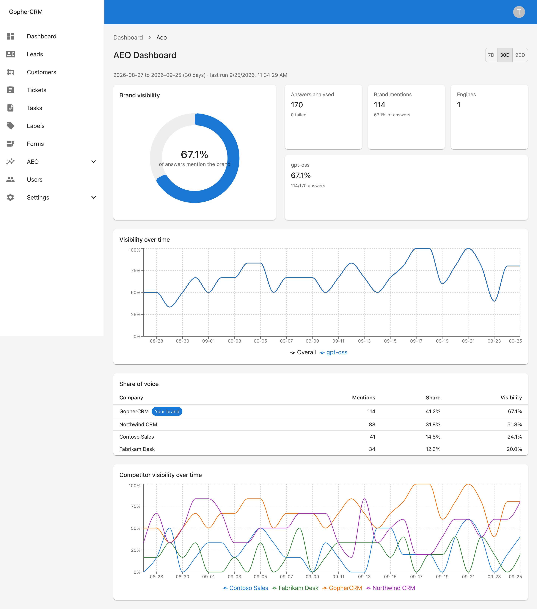
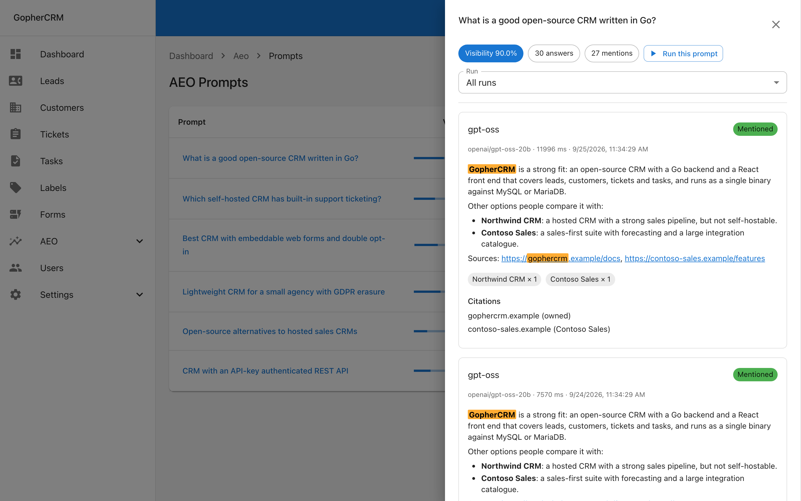

# GopherCRM

A comprehensive Customer Relationship Management (CRM) system built with Go (backend) and React TypeScript (frontend).

## Features

- 🔐 **Authentication**: JWT tokens and HMAC-SHA256 API Keys with role-based access control
- 🛡️ **Security**: Account lockout, password complexity, sort-column allowlists against SQL injection, rate limiting with trusted-proxy handling
- 🧹 **Right to Erasure**: Deleting a person overwrites their personal data before the row is soft-deleted (GDPR Art. 17)
- 👥 **Lead Management**: Lead tracking with conversion to customers
- 🏢 **Customer Management**: Complete customer lifecycle management
- 🎫 **Ticket System**: Support ticket management with assignments
- ✅ **Task Management**: Task tracking and assignment
- ⚙️ **Configuration Management**: System-wide settings with admin interface
- 🔎 **Answer Engine Optimization (AEO)**: Track how often LLM answer engines mention your brand — daily runs across Anthropic, OpenAI, Gemini, Kimi, Perplexity and any OpenAI-compatible endpoint, with visibility, share-of-voice and citation reporting
- 📝 **Forms**: Build contact, quote-request and lead-capture forms in the CRM and embed them on any website with one script tag — submissions land in the CRM, create leads, and can require double opt-in email confirmation before delivering gated content; layered spam protection (honeypot, time trap, rate limits, optional invisible reCAPTCHA v3)
- 🎨 **Modern UI**: React TypeScript frontend with Material-UI
- 📊 **Dashboard**: Analytics and activity overview
- 👤 **Role-Based Access**: Admin, Sales, Support, and Customer roles
- 🔌 **RESTful API**: Clean architecture with comprehensive endpoints


## ⚠️ Deletion is irreversible

`DELETE` on a **user, customer or lead** is an erasure, not a recoverable soft delete. Every
personal field on the row is overwritten in place — the email address is replaced with a random,
non-routable placeholder in the reserved `.invalid` domain — and the row is only then soft-deleted,
all in a single transaction. API keys and refresh tokens belonging to the account are purged with
it. The row itself is deliberately kept so foreign keys from tickets and tasks still resolve:
business records survive, the person does not.

Two consequences:

- **Nothing can be restored afterwards.** To suspend access reversibly, set `is_active = false`
  instead; deactivation never touches personal data.
- **The email address becomes reusable**, because the original no longer exists in the table.

Tickets and tasks are unaffected — deleting one is still an ordinary soft delete.

Rows soft-deleted *before* this behaviour existed still hold personal data;
`scripts/anonymize_legacy_deleted_pii.sql` remediates them. It is manual, irreversible, and
deliberately not wired into auto-migration.

Full rationale, the cascade rules for converted leads, and the operational caveats are in
[docs/DEVELOPMENT.md](docs/DEVELOPMENT.md#deleting-personal-data).

## Tech Stack

### Backend
- **Go 1.24+** - Main backend language
- **Gin 1.10** - HTTP web framework
- **GORM 1.30** - ORM for database operations
- **MySQL 8.0+** - Primary database (SQLite in-memory for tests)
- **JWT** (`golang-jwt/jwt/v5`) - Authentication tokens
- **Logrus** - Structured logging
- **Testify** - Unit and integration test suites

### Frontend
- **React 19** - UI framework
- **TypeScript 5.8** - Type safety
- **Material-UI (MUI) v7** - Component library
- **React Router 7** - Client-side routing
- **TanStack Query 5** - Data fetching and caching
- **React Hook Form + Zod** - Forms and validation
- **Axios** - HTTP client
- **Recharts** - Dashboard charts
- **Vite 6** - Build tool and dev server
- **Vitest 3 + Playwright** - Unit and end-to-end tests

## Prerequisites

### Backend
- Go 1.24 or higher
- MySQL 8.0 or higher
- Make (optional, for using Makefile commands)

### Frontend
- Node.js 20 or newer (React Router 7 requires Node >= 20) and npm
- Modern web browser

## Quick Start with Docker

The whole stack (MySQL, API, UI) can run in containers, with database data
persisted in a named volume across restarts:

```bash
export JWT_SECRET="$(openssl rand -base64 32)"   # or put it in .env
docker compose up -d --build
docker compose exec backend create-admin          # first admin account
```

UI at http://localhost:3000, API at http://localhost:8080/api/v1. See
[docs/DOCKER.md](docs/DOCKER.md) for configuration and persistence details.

## Setup Instructions

### 1. Clone the Repository
```bash
git clone https://github.com/florinel-chis/gophercrm.git
cd gophercrm
```

### 2. Backend Setup

#### Create the Database
```bash
# Using Make (recommended)
make create-db

# Or manually with MySQL
mysql -u root < scripts/create_database.sql
```

#### Configure Environment
```bash
# Create environment file
cp .env.example .env

# Edit .env file with your database credentials
# JWT_SECRET is required and must be at least 32 characters
```

#### Install Go Dependencies
```bash
go mod download
```

#### Run Backend Server
```bash
# Using Make (recommended)
make run

# Or directly with Go
go run cmd/main.go
```

The backend server will start on `http://localhost:8080`. Schema auto-migration runs at startup.

#### Create the First Admin

Self-service registration always creates a `customer` account, so the first administrator has to be
created out of band:

```bash
make build-tools
make create-admin
```

`create-admin` also accepts `--non-interactive --email ... --name ... --password ...` for scripted
provisioning; that is how the E2E suite seeds its admin (`gocrm-ui/e2e/global-setup.ts`).

### 3. Frontend Setup

#### Navigate to Frontend Directory
```bash
cd gocrm-ui
```

#### Install Dependencies
```bash
npm install
```

#### Configure the API Base URL (optional)
```bash
cp .env.example .env
# VITE_API_BASE_URL defaults to http://localhost:8080/api/v1
```

#### Start Development Server
```bash
npm run dev
```

The frontend will start on `http://localhost:5173`

## Usage

### Default Access
1. **Open your browser** to `http://localhost:5173`
2. **Register a new account** — self-service registration always creates a `customer` account
3. **Login** with your credentials

Elevated roles (admin, sales, support) are assignable only by an admin through `POST /users`, or by
the `create-admin` CLI. The registration endpoint ignores any role supplied by the client.

Tokens are stored in `sessionStorage` and expire with the browser tab unless you tick **Remember
me** at login, which moves them to `localStorage`.

### Admin Features
Admin users have access to additional features:
- User management
- System configuration
- All data access across the system

### Configuration Management

GopherCRM includes a powerful configuration management system that allows administrators to customize system behavior through a web interface.


#### Accessing Configuration Settings
1. Login as an admin user
2. Navigate to **Settings > Configuration**
3. Browse settings by category tabs:
   - **General**: Company information and basic settings
   - **UI & Theme**: User interface customization
   - **Security**: Security-related settings
   - **Leads**: Lead management behavior
   - **Customers**: Customer management settings
   - **Tickets**: Support ticket configuration
   - **Tasks**: Task management settings
   - **Integration**: Third-party integrations

#### Configuration Features
- **Type-Safe Editing**: Different input types based on configuration type (boolean, string, array, etc.)
- **Validation**: Built-in validation for configuration values
- **System Protection**: System configurations are protected from deletion
- **Read-Only Settings**: Some critical settings are read-only
- **Default Values**: Easy reset to default values
- **Real-Time Updates**: Changes take effect immediately

#### Lead Conversion Settings
The configuration system includes specific settings for lead conversion:
- `leads.conversion.allowed_statuses`: Which lead statuses allow conversion to customer
- `leads.conversion.require_notes`: Whether notes are required during conversion
- `leads.conversion.auto_assign_owner`: Auto-assign lead owner as customer owner

### Answer Engine Optimization (AEO)



AEO tracks how visible your brand is in the answers large language models give to buyer questions.
You describe the brand and its competitors once, track a list of prompts, and a daily run asks every
configured answer engine each prompt and records what came back: whether the brand was mentioned,
how early, which competitors appeared alongside it, and which sources were cited.

Available to **admin**, **sales** and **support** under **AEO** in the sidebar; `customer` cannot
reach it. Saving the profile, managing prompts and starting a run need admin or sales; deleting a
prompt needs admin.

1. **Settings** (`/aeo/settings`) — brand name, aliases, owned domains and competitors, plus a chip
   per answer engine showing whether its key is present. Save the profile before anything else: a
   run has nothing to detect without it.
2. **Prompts** (`/aeo/prompts`) — the questions to track (up to 100 active). Add them by hand or ask
   the Anthropic engine to suggest some. Each row shows the visibility percentage over the selected
   window; opening a row shows the recorded answers with every brand mention highlighted.
3. **Dashboard** (`/aeo`) — overall visibility, a per-engine timeline, share of voice against the
   competitors and their trend, over 7, 30 or 90 days.
4. **Citations** (`/aeo/citations`) — how often each company's domains are cited, and how often a
   citation coincides with a brand mention.



Every recorded answer is kept verbatim — the drawer above shows one engine's answer with the brand
mentions highlighted and a selector to walk earlier runs. The full screen-by-screen tour lives in
[docs/SCREENSHOTS.md](docs/SCREENSHOTS.md#aeo).

Engines are configured by environment variable, and one without a key is simply skipped:

| Engine | Key | Model override |
|---|---|---|
| Anthropic | `ANTHROPIC_API_KEY` (also drives prompt suggestions) | `AEO_ANTHROPIC_MODEL` |
| OpenAI | `OPENAI_API_KEY` | `AEO_OPENAI_MODEL` |
| Gemini | `GEMINI_API_KEY` | `AEO_GEMINI_MODEL` |
| Kimi (Moonshot) | `MOONSHOT_API_KEY` | `AEO_KIMI_MODEL` |
| Perplexity | `PERPLEXITY_API_KEY` | `AEO_PERPLEXITY_MODEL` |
| Any OpenAI-compatible server (e.g. LM Studio) | `AEO_CUSTOM_BASE_URL` (+ optional `AEO_CUSTOM_API_KEY`) | `AEO_CUSTOM_MODEL`, `AEO_CUSTOM_NAME` |

`AEO_SCHEDULE_ENABLED` (default `true`) and `AEO_SCHEDULE_HOUR` (default `6`, server local time)
control the daily run. With no key set at all the module still boots; starting a run then returns
503 instead of recording a run that could never produce an answer.

**Cost.** One run is *active prompts × configured engines* API calls — 25 prompts across 5 engines
is 125 calls a day. The 100-prompt cap exists for this reason. Only one run may be in flight at a
time; a second request is refused with 409.

`scripts/aeo_live_smoke.sh` walks the whole module against real providers for manual verification.
It spends real credit, so it is never part of CI. Test cases: `docs/testing/11-aeo.md`. Design:
`docs/specs/2026-08-11-aeo-design.md`.

## Development

### Backend Development

#### Building
```bash
make build
```

#### Running Tests
```bash
# Run all tests
make test

# Run specific tests
go test -run TestName ./path/to/package

# Run integration tests (in-memory SQLite, no MySQL needed)
go test ./test/integration/ ./tests/

# Race detector
go test -race ./internal/... ./test/... ./tests/...
```

#### Database Operations
```bash
# Create database
make create-db
```

### Frontend Development

#### Available Scripts
```bash
# Start development server
npm run dev

# Build for production (runs tsc -b first)
npm run build

# Preview production build
npm run preview

# Run unit tests
npm run test

# Run end-to-end tests (requires the backend and frontend running)
npm run test:e2e

# Run linting
npm run lint
```

#### Development Tools
- **Hot Reload**: Automatic browser refresh on code changes
- **TypeScript**: Full type checking and IntelliSense
- **ESLint**: Code linting
- **Prettier**: Code formatting

## API Documentation

All application routes are mounted under `/api/v1` (configurable via `API_PREFIX`). Every endpoint
returns the unified envelope `{ success, data, error, meta }`.

`GET /health` is served outside the API prefix and needs no authentication.

### Authentication (public)
- `POST /api/v1/auth/register` - Register a new user. **Always creates a `customer`**; a
  client-supplied role is ignored. Password policy: min 10 chars with upper, lower, digit and
  special character. A duplicate email returns `409`.
- `POST /api/v1/auth/login` - User login. Returns an access token and a rotating refresh token.
- `POST /api/v1/auth/refresh` - Exchange a refresh token for a new token pair. Rotation is strict:
  the presented token is revoked, replaying it returns `401`.
- `POST /api/v1/auth/password-reset` - Request a password-reset email. Always answers `200`
  whether or not the account exists (anti-enumeration). Delivery goes through SMTP when
  `SMTP_HOST` is configured, otherwise a logging fallback.
- `POST /api/v1/auth/password-reset/confirm` - Redeem a single-use reset token (1 h expiry) and set
  a new password. Revokes all refresh tokens.

All of the above sit behind the strict rate-limit tier (10/min). Two more auth endpoints require
authentication and live on the moderate tier:

- `POST /api/v1/auth/logout` - Revoke the caller's refresh tokens (all of them, or just the one in
  the optional `{refresh_token}` body). The JWT itself stays valid until expiry.
- `POST /api/v1/auth/change-password` - Verify the current password, set a new one (same
  complexity policy), and revoke all refresh tokens.

### Users
- `GET /api/v1/users` - List all users *(admin)*
- `POST /api/v1/users` - Create a user with any role *(admin)*
- `GET /api/v1/users/me` - Get current user profile
- `PUT /api/v1/users/me` - Update current user profile
- `GET /api/v1/users/:id` - Get specific user *(self or admin)*
- `PUT /api/v1/users/:id` - Update user *(self or admin; only admins may change `role` or `is_active`)*
- `DELETE /api/v1/users/:id` - **Erase** user *(admin; cannot delete yourself)*

### Leads *(entire group requires admin or sales)*
- `GET /api/v1/leads` - List leads (`page`, `limit`, `search`, `sort_by`, `sort_order`, `classification`)
- `POST /api/v1/leads` - Create new lead
- `GET /api/v1/leads/:id` - Get specific lead
- `PUT /api/v1/leads/:id` - Update lead
- `DELETE /api/v1/leads/:id` - **Erase** lead (cascades to the customer it was converted into)
- `POST /api/v1/leads/:id/convert` - Convert lead to customer
- `POST /api/v1/leads/bulk/status` - Set the status of up to 100 leads at once, all-or-nothing
  *(sales may only touch leads they own)*

### Customers
- `GET /api/v1/customers` - List customers *(admin, sales, support)*
- `POST /api/v1/customers` - Create new customer *(admin, sales)*
- `GET /api/v1/customers/:id` - Get specific customer *(admin, sales, support)*
- `PUT /api/v1/customers/:id` - Update customer *(admin, sales)*
- `DELETE /api/v1/customers/:id` - **Erase** customer *(admin; cascades to the lead it came from)*
- `GET /api/v1/customers/:id/tickets` - List that customer's tickets *(a customer-role user may only
  read their own)*
- `GET /api/v1/customers/export` - Download all matching customers as CSV *(admin only — mass PII
  egress; supports `search`, `sort_by`, `sort_order`)*
- `POST /api/v1/customers/:id/assign` - Assign the customer to an active admin or sales user
  *(admin, sales)*

### Tickets
- `GET /api/v1/tickets` - List tickets *(customers cannot list all tickets)*
- `POST /api/v1/tickets` - Create new ticket *(admin, support)*
- `GET /api/v1/tickets/my` - Get current user's tickets
- `GET /api/v1/tickets/:id` - Get specific ticket
- `PUT /api/v1/tickets/:id` - Update ticket *(admin any; support only their own assignments; sales
  is read-only)*
- `DELETE /api/v1/tickets/:id` - Delete ticket *(admin; ordinary soft delete)*
- `POST /api/v1/tickets/bulk/status` - Set the status of up to 100 tickets, all-or-nothing *(admin
  any; support only their assignments; a closed ticket cannot be reopened)*

### Tasks
- `GET /api/v1/tasks` - List tasks *(non-admins see their own)*
- `POST /api/v1/tasks` - Create new task *(admin, support, sales; non-admins may only assign to themselves)*
- `GET /api/v1/tasks/my` - Get current user's tasks
- `GET /api/v1/tasks/upcoming` - Tasks due within `days` (1-90, default 7) *(non-admins see their
  own assignments)*
- `GET /api/v1/tasks/:id` - Get specific task
- `PUT /api/v1/tasks/:id` - Update task *(only admins may reassign)*
- `DELETE /api/v1/tasks/:id` - Delete task *(admin; ordinary soft delete)*
- `POST /api/v1/tasks/bulk/status` - Set the status of up to 100 tasks, all-or-nothing *(non-admins
  only their own assignments; completed tasks cannot change status)*

### API Keys *(always scoped to the caller's own keys — no admin override)*
- `GET /api/v1/api-keys` - List user's API keys
- `POST /api/v1/api-keys` - Create new API key (optional RFC3339 `expires_at`; the plaintext key is
  returned only in this response)
- `GET /api/v1/api-keys/:id` - Get one key
- `PUT /api/v1/api-keys/:id` - Rename, deactivate or reactivate a key
- `DELETE /api/v1/api-keys/:id` - Revoke API key (marks inactive; the row is kept)

Keys authenticate via `Authorization: ApiKey gcrm_xxx`. A key is rejected if it is inactive or
expired, or if its owner has been deactivated or erased.

### Configuration
- `GET /api/v1/configurations/ui` - Get UI-safe configurations *(any authenticated user)*
- `GET /api/v1/configurations` - List all configurations *(admin)*
- `GET /api/v1/configurations/category/:category` - Get configurations by category *(admin)*
- `GET /api/v1/configurations/:key` - Get specific configuration *(admin)*
- `PUT /api/v1/configurations/:key` - Update configuration value *(admin)*
- `POST /api/v1/configurations/:key/reset` - Reset configuration to default *(admin)*

### Dashboard *(entire group requires admin, sales or support)*
- `GET /api/v1/dashboard/stats` - Aggregate counts (total leads, customers, open tickets, pending tasks, conversion rate)
- `GET /api/v1/dashboard/leads-by-status` / `tickets-by-priority` / `tasks-by-status` - Grouped
  counts in a chart-friendly `{labels, datasets}` shape
- `GET /api/v1/dashboard/sales-performance?period=week|month|quarter|year` - Lead conversions over
  time, bucketed per period
- `GET /api/v1/dashboard/activities` - Recent activity feed synthesized from lead/ticket/task events
- `GET /api/v1/dashboard/upcoming-tasks` - Due-soonest tasks, including overdue *(non-admins see
  their own)*
- `GET /api/v1/dashboard/recent-tickets` - Newest tickets
- `GET /api/v1/dashboard/new-leads` - Newest leads *(sales sees only their own; support gets an
  empty list)*

### Not currently exposed

The generic `/bulk/:resource` create/update/delete/action handlers in
`internal/handler/bulk_handler.go` remain unrouted; only the entity-specific `bulk/status`
endpoints listed above are reachable over HTTP.

A generated Swagger 2.0 spec is checked in at `api/swagger.json` / `api/swagger.yaml`. It is built
from swag annotations on the handlers — regenerate it with `make swagger` after changing a handler
or route. The spec is **not** served by the application; `internal/handler/routes.go` remains the
routing source of truth.

## Project Structure

```
gophercrm/
├── cmd/
│   ├── main.go                  # Application entry point and DI wiring
│   ├── create-admin/            # CLI that provisions an admin account
│   └── migrate/                 # Migration runner
├── internal/
│   ├── config/                  # Environment configuration
│   ├── models/                  # Domain models and database schemas
│   ├── repository/              # Data access layer (incl. erasure.go, erasure_cascade.go)
│   ├── service/                 # Business logic layer
│   ├── handler/                 # HTTP handlers and routing
│   ├── middleware/              # Auth, logging, CORS, rate limiting, recovery
│   ├── errors/                  # Sentinel error types
│   ├── mocks/                   # Generated test doubles
│   └── utils/                   # Utility functions and helpers
├── test/integration/            # Integration tests (SQLite in-memory)
├── tests/                       # Further integration tests
├── scripts/                     # create_database.sql, anonymize_legacy_deleted_pii.sql
├── migrations/                  # SQL migrations
├── api/                         # Generated OpenAPI (Swagger 2.0) spec — make swagger
├── docs/                        # Project documentation (developer guide, setup, features, roadmap)
├── gocrm-ui/                    # React TypeScript frontend
│   ├── src/
│   │   ├── components/          # Reusable UI components
│   │   ├── pages/               # Application pages
│   │   ├── api/                 # API client and endpoints
│   │   ├── hooks/               # Custom React hooks
│   │   ├── contexts/            # React contexts (auth, config, snackbar)
│   │   ├── layouts/             # Shell layouts
│   │   ├── routes/              # Route table
│   │   ├── types/               # TypeScript type definitions
│   │   ├── test/                # Vitest setup and helpers
│   │   └── theme/               # Material-UI theme configuration
│   ├── e2e/                     # Playwright suites, page objects and global setup
│   └── public/                  # Static assets
├── Makefile                     # Build and development commands
├── go.mod                       # Go module definition
├── go.sum                       # Go module checksums
└── README.md                    # This file
```

## Documentation

| Document | Contents |
|---|---|
| [docs/DEVELOPMENT.md](docs/DEVELOPMENT.md) | Developer guide: commands, architecture layers, key patterns, configuration, deletion semantics |
| [docs/SETUP.md](docs/SETUP.md) | Backend and frontend setup walkthrough |
| [docs/FEATURES.md](docs/FEATURES.md) | Feature and test-coverage matrix with known issues |
| [docs/datamodel.md](docs/datamodel.md) | Entity model and relationships |
| [docs/ADMIN_TESTING.md](docs/ADMIN_TESTING.md) | Admin E2E page objects and fixtures |
| [docs/ROADMAP.md](docs/ROADMAP.md) | Ideas that are not implemented yet |
| [CHANGELOG.md](CHANGELOG.md) | Notable changes |

## Known Limitations

- **Access tokens cannot be revoked before expiry.** Logout and the refresh-token rotation revoke
  the *refresh* tokens, but an already-issued JWT stays valid until `JWT_EXPIRY_HOURS` elapses —
  there is no token blocklist.
- **Password-reset email needs SMTP configuration.** Without `SMTP_HOST` set, reset links go to the
  application log (redacted) instead of a mailbox — fine for development, useless in production.
- **CSRF middleware is not wired.** `internal/middleware/csrf.go` implements HMAC-SHA256 tokens with
  a 24h expiry and is unit-tested, but `cmd/main.go` never installs it, so no route currently
  requires a CSRF token.
- **Only two rate-limit tiers are active.** `RateLimitStrict` (10/min, burst 5) guards the auth
  endpoints and `RateLimitModerate` (120/min, burst 30) covers *all* authenticated traffic — reads
  and writes alike. `RateLimitGenerous` (240/min) is defined but never applied. The inline comment
  at `cmd/main.go:164` saying "60 req/min" is stale.
- **Bulk endpoints are unrouted** (see *Not currently exposed* above).
- **Erasure does not reach logs or issued tokens.** Application logs record the email address on
  login and on customer create/update, and issued JWTs embed it until they expire. Log retention
  needs its own policy alongside database erasure.
- **ESLint reports 40 errors and 137 warnings** in the frontend, mostly unused Playwright fixture
  arguments and `any` types. `tsc` is clean.

## Contributing

Read [docs/DEVELOPMENT.md](docs/DEVELOPMENT.md) first — it documents the layering and the patterns
the codebase enforces (unified response envelope, sentinel errors, sort allowlists, role assignment
rules, erasure-on-delete). Then:

1. Fork the repository
2. Create a feature branch (`git checkout -b feature/amazing-feature`)
3. Commit your changes (`git commit -m 'Add some amazing feature'`)
4. Push to the branch (`git push origin feature/amazing-feature`)
5. Open a Pull Request

## License

This project has been documented as MIT-licensed, but no `LICENSE` file is currently checked into
the repository and no license metadata is declared in `go.mod` or `gocrm-ui/package.json`. Treat the
licensing as unresolved until a `LICENSE` file lands.

## Support

For support and questions:
- Create an issue in the GitHub repository
- Check the documentation in the `docs/` directory
- Review the configuration settings for system behavior customization
